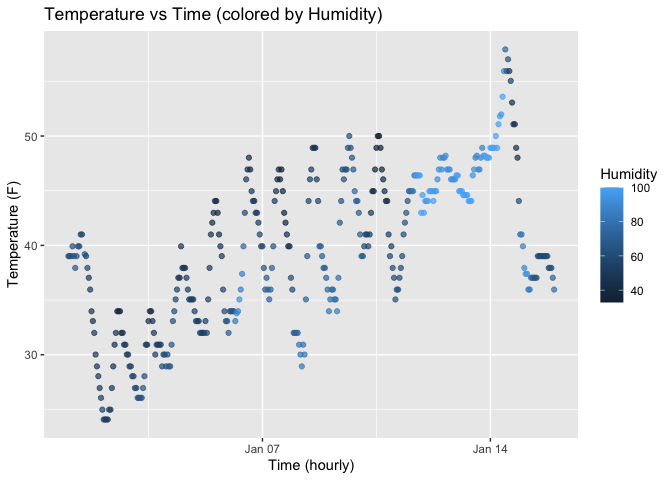

P8105 Homework 1
================
Aisha Waggeh
September 20 2025

``` r
# Load the early_january_weather dataset
data("early_january_weather")
```

I’m an R Markdown document!

# Problem 0.1

This .Rmd file is part of my GitHub repo for Homework 1. It renders to
github_document, and the repo is organized as instructed.

# Problem 0.2

I will follow good coding style by:

- using clear variable names,
- writing one command per line,
- adding white space for readability,
- and explaining results in plain text.

# Problem 1: Exploring Early January Weather

We will first explore the ‘early_january_weather’ dataset. I rename data
set to weather_df

``` r
data("early_january_weather")
weather_df = early_january_weather
```

- The dataset has 358 rows and 15 columns.  
- The variables are: origin, year, month, day, hour, temp, dewp, humid,
  wind_dir, wind_speed, wind_gust, precip, pressure, visib, time_hour.  
- The mean temperature is 39.58 °F.

\#I made a scatterplot of temp (y) vs time_hour (x); color points using
humid variable & adding color inside of aes in my ggplot.

``` r
ggplot(weather_df, aes(x = time_hour, y = temp, color = humid)) +
  geom_point(alpha = 0.7) +
  labs(
    title = "Temperature vs Time (colored by Humidity)",
    x = "Time (hourly)",
    y = "Temperature (F)",
    color = "Humidity"
  )
```

<!-- -->

``` r
#  Display and save the plot to my project directory

 ggsave("temp_vs_humid.png", width = 6, height = 4)
```

*Observations from the scatter plot*

- Temperature fluctuates across the observed hours between Jan 07 and
  Jan 14.
- Points are colored by humidity. Higher humidity tends to occur at
  higher temperatures.
- Overall, the scatterplot shows how temperature and humidity vary
  together during early January.

# Problem 2

\*In this problem, I created a data frame with four types of variables:

1.  A random sample of size 10 from a standard Normal distribution.
2.  A logical vector indicating whether each sample value is greater
    than 0.
3.  A character vector of length 10.
4.  A factor vector of length 10, with three different factor levels.

``` r
set.seed(123) # this numbers for reproducibility
  
#create variables
  sample_vec = rnorm(10)
  logical_vec = sample_vec > 0
  char_vec = c("a", "b", "c", "d", "e", "f", "g","h", "i", "j")
  factor_vec = factor(rep(c("low", "medium", "high"), length.out = 10))
  
  
#combine into a dataframe
    df = data.frame(
      sample = sample_vec,
      logical= logical_vec,
      character = char_vec,
      factor = factor_vec
    )
    df
```

    ##         sample logical character factor
    ## 1  -0.56047565   FALSE         a    low
    ## 2  -0.23017749   FALSE         b medium
    ## 3   1.55870831    TRUE         c   high
    ## 4   0.07050839    TRUE         d    low
    ## 5   0.12928774    TRUE         e medium
    ## 6   1.71506499    TRUE         f   high
    ## 7   0.46091621    TRUE         g    low
    ## 8  -1.26506123   FALSE         h medium
    ## 9  -0.68685285   FALSE         i   high
    ## 10 -0.44566197   FALSE         j    low

\#Now I will try to take the mean of each variable in my dataframe.

``` r
library(tidyverse)

mean(df %>% pull(sample))     # works
```

    ## [1] 0.07462564

``` r
mean(df %>% pull(logical))    # works (TRUE = 1, FALSE = 0)
```

    ## [1] 0.5

``` r
mean(df %>% pull(character))  # will not work b/c non-numeric
```

    ## Warning in mean.default(df %>% pull(character)): argument is not numeric or
    ## logical: returning NA

    ## [1] NA

``` r
mean(df %>% pull(factor))     # will not work b/c non-numeric
```

    ## Warning in mean.default(df %>% pull(factor)): argument is not numeric or
    ## logical: returning NA

    ## [1] NA

\#Now I will apply ‘as.numeric’ to the logical, character, and factor
variables created.

``` r
as.numeric(df$logical)   # TRUE becomes 1, FALSE becomes 0
```

    ##  [1] 0 0 1 1 1 1 1 0 0 0

``` r
as.numeric(df$character) # NA with a warning, because characters cannot be converted to numbers
```

    ## Warning: NAs introduced by coercion

    ##  [1] NA NA NA NA NA NA NA NA NA NA

``` r
as.numeric(df$factor)    # returns the internal integer codes used to represent factor levels (not labels themselves)
```

    ##  [1] 2 3 1 2 3 1 2 3 1 2

\#Now on to what is happening in my code chunk when I apply the
‘as.numeric’ to the above:

- Logical vector when we coerce it with ‘as.numeric’ and take the mean
  of the logical colunm works, because it gives the proportion of values
  that are TRUE (the proportion in my sample greater than 0).

- Character vector such as “a” “b” “c” to numeric produces NA with a
  warning, because there is no sensible way to convert letters to
  numbers.

- Factor vector when we coerce it with ‘as.numeric’ returns its integer
  codes such as 1 for “low”, 2 for “medium” and 3 for “high”.

- Lastly, taking the mean of these code would just be averaging aribtary
  integers (which has nothing to do with the factors labels). This
  explains why the mean(factor) did not work directly.
